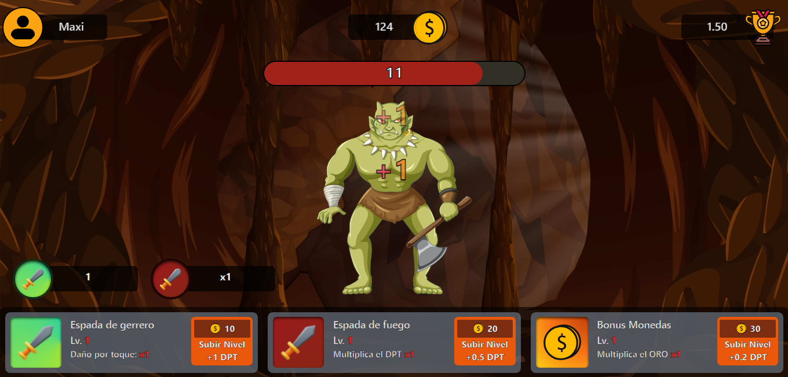

# **Hunting Monsters Clicker**

¡Bienvenido a Hunting Monsters Clicker!

## **Descripción del Juego**
Hunting Monsters Clicker es un adictivo juego en el que tu objetivo es eliminar monstruos a través de clics. Cada monstruo derrotado te recompensa con monedas, las cuales puedes utilizar para mejorar el poder de tus clics.

Al comenzar, tu poder de daño es de 1, lo que significa que cada clic descontara 1 en la vida de un monstruo. Sin embargo, a medida que obtengas más monedas, podrás aumentar el poder de tus clics.¡Siente el poder a medida que tu eficiencia de caza aumenta!

## **Tipos de Monstruos**
En Hunting Monsters Clicker encontrarás tres tipos de monstruos diferentes en el cual todos te daran monedas y puntos:

1. **Monstruo Común:** Estos monstruos te otorgan recompensas básicas. Aunque su recompensa es menor, son una excelente manera de acumular monedas al principio del juego.

2. **Monstruo Raro:** Los monstruos raros ofrecen recompensas más generosas que los monstruos comunes. Si tienes suerte de encontrarlos, serás recompensado con una cantidad significativamente mayor de monedas.

3. **Monstruo Épico:** Los monstruos épicos son las criaturas más desafiantes y valiosas del juego. Derrotar a un monstruo épico te proporcionará recompensas que superan incluso a los monstruos comunes y raros juntos. Prepárate para un desafío emocionante y lucrativo al encontrarte con estos temibles enemigos.

## **Cómo Jugar**
1. Haz clic en los monstruos para eliminarlos y obtener monedas y puntos.
2. Utiliza las monedas para mejorar tu poder de clics y derrotar a los monstruos más rápidamente.
3. Continúa cazando monstruos, aumentando tu poder y recolectando recompensas cada vez mayores.

¡Desafía tus habilidades de clic y conviértete en el mejor cazador de monstruos!
